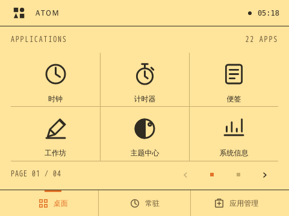
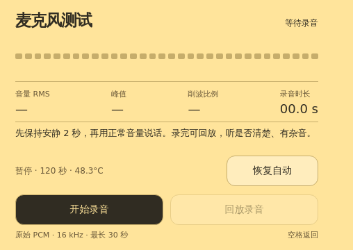

# ATOM · 独立桌面 AI 终端

ATOM 是运行在 RK3566 小电脑上的全屏应用系统原型。它保留 Debian 和板厂驱动，用本地 Python 服务、Chromium/EGL 和统一的应用规范，将这台设备变成可以独立使用、通过语音创建应用、运行互动图形作品的桌面终端。

**本阶段开发截至 2026-10-08。** 当前实现侧重独立设备体验：电脑 agent 接入是未来扩展，设备不依赖个人电脑保持开机。应用生成和语音服务调用云端 API；基础应用与已部署素材可以离线运行。这里没有部署大型本地语言模型。



> 仓库保留原有项目；本目录是透明板上的 ATOM 实现。早期计划和验收报告用于追溯，本 README 与[文档索引](docs/README.md)描述当前交付。

## 功能与交互

| 功能 | 当前实现 |
| --- | --- |
| 桌面 | 480×360，3×2 大图标分页；鼠标拖动、滚轮、方向键、分页按钮；新安装应用追加末尾，更新保留位置 |
| 全屏应用 | 进入应用后隐藏系统常驻顶部/底部；只在必要内容区域滚动；退出回到打开应用时的桌面页 |
| Home / 空格 | 短按退出到原桌面页；已在桌面时短按回第一页。文本输入时保留普通空格 |
| 按住说话 | 长按约 650 ms 启动录音，松手自动停止并转写；麦克风启动期间松手也会处理；最长 30 秒 |
| 工作坊 | 文字或录音输入 → 模型生成 → 状态反馈 → 隔离预览 → 安装/更新；需求草稿保存、任务查询与网络重试 |
| 应用数据 | AtomApp v1 SDK，应用独立 JSON 保存，64 KiB 限额；预览数据隔离；读取失败禁止默认值覆盖 |
| 主题与图标 | 官方主题、本地主题包导入、主题图标覆盖；每个应用都有独立语义 SVG，颜色和图标底板跟随系统主题 |
| 语音 | 云端 ASR 与 TTS；设备扬声器播放；实际录音/转写/生成/播报状态驱动表情；语音提示可关闭 |
| 麦克风测试 | 原始 PCM 录音、实时 RMS/峰值/削波、最长 30 秒、扬声器回放 |
| 风扇控制 | 测试应用可临时暂停风扇；语音需求录音自动暂停；停止、退出、失联或温度保护后恢复自动温控 |
| 设备管理 | 系统状态、音量、背光、开发模式、应用安装更新卸载、图形会话与显示恢复机制 |

目前样机桌面包含 9 个内置入口和 41 个安装应用（含麦克风测试）。部分安装应用来自工作坊或早期示例，不全部对应一个 `ports/` 目录。联网应用市场、联网主题市场还没有交付，本地安装管理与主题导入已经可用。

## 画面与应用

`ports/` 包含适配的小屏幕应用和上游许可；`templates/` 与 `examples/` 提供可导入的 JSON 应用包。

| 类别 | 项目 |
| --- | --- |
| GPU 图形 | fluid-atlas、fluid-paint、water-pool、volume-flow、moon-ocean、living-pattern |
| 天体与模型 | planetarium、model-viewer、material-world |
| 创作与科学 | pocket-studio、clay-studio、parametric-maker、fold-lab、circuit-lab、math-playground、physics-playground |
| 音乐互动 | music-vision、rhythm-orbits |
| 点阵 | dot-life、dot-image、dot-waves、dot-theater |
| 可爱表情 | robo-face、kaia-face、pixel-companion、snappy-face |
| 原生体验示例 | 七次练习、饮水计数模板、工具/信息/音乐/趣味模板、麦克风测试 |

完整上游来源、固定提交、改动和授权见 [ports/README.md](ports/README.md) 及各应用目录。真实计算场景保留有意义的颜色，工具控件跟随 ATOM 主题。并非所有应用都包含联网能力或专业工具的完整功能。



## 硬件与运行环境

样机为透明版泰山派：RK3566、Mali-G52、约 8 GB RAM、480×360 DSI 屏幕，Debian 10 / Linux 4.19.232 / Chromium 91。当前通过鼠标和键盘测试，没有摄像头，也没有实测触屏；触屏和实体 Home 键属于下一版硬件。

- GPU：原生 EGL/GLES，已验证 WebGL 和 GPU 栅格化。GLX 的 llvmpipe 结果不能代表这条 EGL 路径。
- VPU：已实播 H.264 硬解；原生 MPP 编解码、H.265 合成码流测试有记录，不等于浏览器全面支持 HEVC。
- RGA：原生图像缩放测试通过。
- NPU：RKNN MobileNet 真实执行通过；没有把 NPU 基准等同于 ASR、TTS 或 OCR 产品已实现。
- 音频：RK809 codec、PulseAudio、`parec` 收音、`paplay` 回放。样机 Pulse socket 为 `/tmp/pulse-socket`。

帧率、延迟等是具体样机的短测结果，不是所有硬件配置的性能承诺。详见[硬件能力基线](docs/hardware-capabilities.md)、[GPU 接入](docs/gpu-enablement.md)。

## 本地开发

```bash
python3 atom/server.py
```

从仓库根目录启动，打开 `http://127.0.0.1:8770`。Python 3.7+，后端无 pip 依赖；无需 Node 构建桌面。非 Linux 环境可开发界面和应用管理，真实音频、背光、温度和 GPU 需要目标设备。

```bash
python3 -m unittest discover -s atom/tests -v
node atom/tests/app-host.test.cjs
node atom/tests/app-runtime.test.cjs
python3 atom/tools/check_app.py atom/examples/mic-test.json
```

Node 用于协议测试；原生 WASM/上游移植构建另有工具要求，见各构建脚本和移植文档。

## 在 Debian 样机部署

先备份目标设备的图形会话、systemd、音频与显示配置。当前部署脚本面向用户名 `linaro`、路径 `/home/linaro/atom` 的这台 BSP 样机，其他板卡需要按实际系统适配，不是通用刷机工具。

1. 将 `atom/` 复制到 `/home/linaro/atom`，安装 Python 3、Chromium、Openbox、LightDM、PulseAudio、ALSA 工具、curl 和 xset 等运行依赖。
2. 设备执行 `sh /home/linaro/atom/deploy/install.sh`，安装后端与专用图形会话。
3. 图形登录选择 ATOM；`start-atom.sh` 使用原生 `chromium-bin` 和 EGL。会话自动恢复浏览器，后端由 systemd 自动重启。
4. 显示保护服务和 Xorg 配置需依照[部署指南](docs/deployment.md)单独审核安装。
5. 应用包安装前在设置启用开发模式；第三方大型移植必须复制完整资源目录。

```bash
systemctl status atom
journalctl -u atom -n 50 --no-pager
```

服务只绑定本机回环地址。远程管理推荐 SSH 隧道：

```bash
ssh -N -L 8770:127.0.0.1:8770 DEVICE_USER@DEVICE_HOST
python3 atom/tools/deploy_app.py --target http://127.0.0.1:8770 list
python3 atom/tools/deploy_app.py --target http://127.0.0.1:8770 install atom/examples/mic-test.json
```

具体私有设备地址、密码、SSH 私钥、模型密钥不随仓库发布。

## 模型与语音配置

工作坊 → 模型配置，分别配置应用生成、录音转写与语音播报。主流协议入口和厂商预设可用，但不是所有厂商、所有模型都已逐一真机验证。

- 应用生成：样机默认 DeepSeek `deepseek-flash`；生成代码需预览和操作验证。
- 录音转写：智谱 `glm-asr-2512`，上传 16 kHz、单声道原始 WAV。
- 文字播报：智谱 `glm-tts`，默认彤彤 `tongtong`，支持 7 个音色，最多 1024 字。
- ASR/TTS 独立于生成模型；需要网络和用户自己的有效账户/API Key。
- 密钥存放在设备 `state/model.json`，权限 0600；配置 API 只返回是否设置，不返回明文。

按住空格说应用需求，松手后转写到可编辑的需求框，然后由用户发起生成。语音当前不是完整的自由对话助手。[语音接口与验收](docs/voice-zhipu.md)。

## 麦克风与风扇诊断

样机自接两线咪头安装在机壳内，用户提供原理图显示 MIC1p 接入、MIC1n 悬空；系统原设备树却启用差分模式。目前使用可恢复的单端运行时测试，未修改启动镜像，尚未证明底噪已经解决。

麦克风测试显示数字电平 dBFS，不是声压计，也不是声波形。先保持安静，再以固定距离说同一句话，录音回放比较风扇开关、咪头位置和人声清晰度。测试保留原始声音，没有用降噪掩盖底噪。

风扇控制依赖本机 GPIO3 A4 和已有 `taishan-fan` 服务。临时关闭最多 120 秒，60°C 恢复散热；页面失联 5 秒后恢复。按住说话期间由录音服务保持暂停，录音失败/停止/超时恢复温控。风扇未接通或温度不允许暂停时，语音仍可录制。

安装、恢复和权限说明见[音频与风扇指南](docs/audio-diagnostics.md)。不要将此板专用寄存器或 GPIO 设置直接用于其他硬件。

## 应用开发规范

- 应用全屏，避免网页式整页滚动；必要列表独立滚动。
- 每个应用提供独立 `icon.svg`，64×64 viewBox、透明、单色 `currentColor`；主题负责图标底色、边框、圆角和墨色。
- 普通应用跟随当前系统主题；固定主题是明确选择。
- `AtomApp.deferReady()/ready()` 表达真实启动状态；`load/save` 提供独立数据保存；`onSuspend` 清理定时器、音频、GPU。
- `iframe sandbox="allow-scripts"` 不授予同源权限。设备能力通过限定当前来源的 shell 桥接，不给任意应用开放写 API。
- 更新保留图标、安装顺序；新应用追加到桌面末尾。

阅读[应用协议](docs/app-contract.md)、[设计规范](docs/design-system.md)、[开发指南](docs/developer-guide.md)和 [AGENTS.md](../AGENTS.md)。

## 仓库结构

```text
atom/
  server.py                 本地 API、静态服务、安装器
  workshop.py               模型适配、生成任务、配置管理
  voice.py / stt.py / tts.py  真机录音、云转写、异步播报
  static/                   桌面、工作坊、主题与应用 SDK
  deploy/                   样机启动、显示保护、音频诊断工具
  docs/                     当前指南、设计规范、历史验证
  templates/ / examples/    JSON 应用包
  ports/                    完整移植资源与上游许可证
  mic-test/                 麦克风测试源文件
  tools/                    构建、校验、部署和硬件测试工具
  tests/                    后端与 JS 协议测试
  artifacts/                不含密钥的截图及验收记录
```

`apps/`、`state/`、`vendor/`、缓存与设备私有配置不提交。`ports/` 保留可部署资源；部分入口 `bundle.json` 不含大型纹理/WASM/JS，不能只安装入口包就宣称完成离线部署。

## 当前边界与后续工作

- 尚无电脑 agent 的正式桥接、云平台账户体系、联网应用/主题市场、通用 OCR 应用、摄像头/手势功能。
- 后端生成任务保存在内存；页面重载和短暂断网可恢复查询，服务重启后任务失效，草稿仍保留。
- JSON 安装有运行时回滚，不保证断电事务；还需要系统升级、签名分发、持续负载和断电测试。
- Debian 10 / Chromium 91 是原型 BSP；启动器使用 `--no-sandbox`，iframe 隔离不能代替操作系统沙箱。正式产品必须升级受维护底座并完成安全验证。
- 下一版触屏、物理 Home 键、音频硬件布局和风扇声学隔离仍需真实硬件验证。
- 多个上游采用 MIT / Apache / GPL 等不同许可。保留每个项目的 LICENSE、版权和源码；不要将整个移植合集当作统一许可。部分图片素材的商业授权还需单独核对。

当前暂停功能开发，保留可运行样机、源代码、文档和测试证据作为下一阶段基线。
