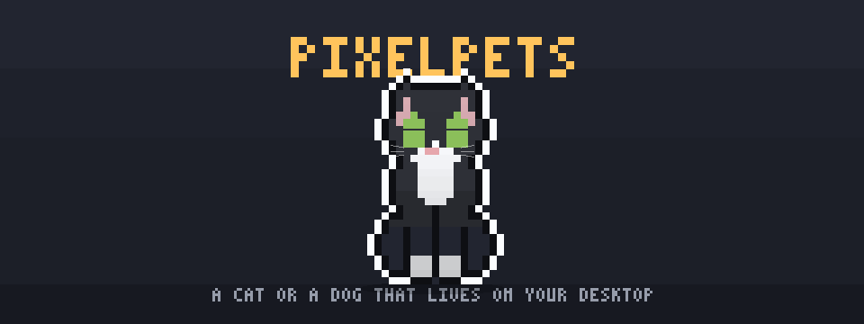
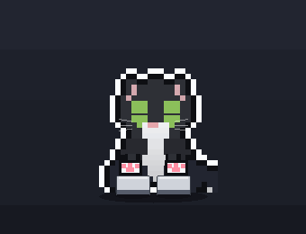
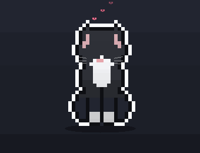
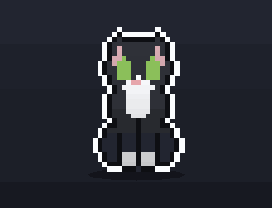
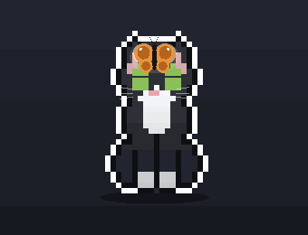
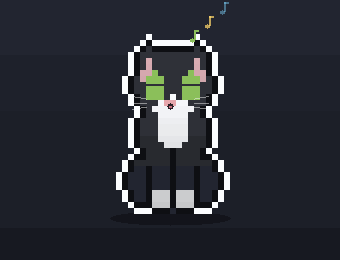
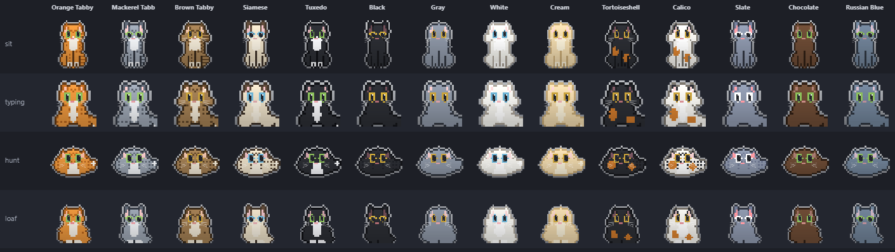

<div align="center">


# pixelpets

A pixel cat (or dog) that lives on your desktop.

[](https://github.com/JOhnsonKC201/pixelpets/actions/workflows/ci.yml)
&nbsp;[](https://github.com/JOhnsonKC201/pixelpets/releases/latest)
&nbsp;[](LICENSE)



<sub>This is rendered from the app's own sprite code, not a screen recording (<a href="assets/hero-banner.mp4">MP4</a>). The coat is Tuxedo.</sub>

**[Download for Windows](https://github.com/JOhnsonKC201/pixelpets/releases/latest)** &nbsp;·&nbsp; [macOS beta](https://github.com/JOhnsonKC201/pixelpets/releases/latest) &nbsp;·&nbsp; [Try it in your browser](https://pixelcat-jet.vercel.app)

</div>

It sits in the corner of your screen and keeps you company. It watches your cursor, kneads the keyboard while you type, purrs when you pet it, and stretches like mochi if you drag it around. If you'd rather have a dog, there's a Black Lab that play-bows, pants and fetches a tennis ball.

Almost everything is drawn in code at runtime. The only painted frames are the rope climb on four of the coats. There are no sound files either: the meows, barks and purrs are synthesized as they play.

The [browser demo](https://pixelcat-jet.vercel.app) runs the same renderer as the app, so it's a decent way to see if you like it before installing anything.

## Install

**Windows 10 or 11:** grab the installer from the [latest release](https://github.com/JOhnsonKC201/pixelpets/releases/latest) and run it. It uninstalls from Settings > Apps like anything else.

**macOS 12 or newer:** the release has builds for Apple Silicon and Intel. Treat these as a beta. The port is finished, but I haven't been able to run it on a real Mac yet, so if you try it, [an issue](https://github.com/JOhnsonKC201/pixelpets/issues) with what you saw would help a lot.

**From source** (either platform, Node 20+):

```bash
git clone https://github.com/JOhnsonKC201/pixelpets.git
cd pixelpets
npm install
npm start
```

The pet sets itself to start when you log in. `npm run autostart:off` undoes that. Linux isn't supported, because the overlay and the global input hooks only exist for Windows and macOS.

<details>
<summary>About the security warning on first launch</summary>

<br />

The builds aren't code-signed (a signing certificate costs money, and this is a free side project), so your OS will be suspicious the first time.

- Windows shows a blue "Windows protected your PC" screen. Click **More info**, then **Run anyway**.
- macOS won't open it on a double-click. Try once, then go to System Settings > Privacy & Security and click **Open Anyway**. On macOS 14 and older you can also right-click the app and choose Open. macOS 15 took that shortcut away.

If that makes you uneasy, the browser demo needs no install, and building from source skips the installer entirely. The [Privacy](#privacy) section and [SECURITY.md](SECURITY.md) spell out what the app does on your machine. The short version: the keyboard hook only reports that a key was pressed, never which one.

Running from source has two small platform quirks (a silent launcher on Windows, the Accessibility permission on macOS), covered in the [development guide](docs/development.md).

</details>

## What it does

<table align="center">
<tr>
<td align="center"><br /><sub>typing</sub></td>
<td align="center"><br /><sub>petting</sub></td>
<td align="center"><br /><sub>scrolling</sub></td>
<td align="center"><br /><sub>dragging</sub></td>
</tr>
<tr>
<td align="center"><br /><sub>butterfly</sub></td>
<td align="center"><br /><sub>hunting the cursor</sub></td>
<td align="center"><br /><sub>a treat</sub></td>
<td align="center"><br /><sub>singing</sub></td>
</tr>
</table>

Mostly it just reacts to you. Petting, dragging, typing, scrolling and moving the cursor near it all get their own response, and a small energy model decides whether it's in the mood: it can be sleepy, calm, playful or have full-on zoomies.

It also does a few useful things. There's a break timer and a Pomodoro timer, repeating reminders, a note you can pin above its head, unread-mail alerts over IMAP and nudges before calendar events. All of it comes through the pet as a speech bubble. Focus Guard keeps it quiet while you're actually busy (a calendar event in progress, Quiet Hours, or Work mode). Anything it held back shows up afterwards as one line, like "While you were busy: 3 new emails and 1 reminder."

If you use a coding agent, it can follow along. See [AI agent reactions](#ai-agent-reactions) below.

There are 14 cat coats and a Black Lab, and you can design your own. Every coat is the same sprite recoloured when it's drawn, which is why they all get every pose:

<p align="center"></p>

<p align="center"><sub><a href="assets/coat-carousel.gif">Or watch them cycle one at a time.</a></sub></p>

The dog isn't a recoloured cat. It has its own sprite with a proper muzzle, floppy ears and an otter tail. Where the cat crouches to hunt it play-bows, where the cat grooms it pants, and instead of a fish it gets a ball that it actually chases and brings back. Switch between them under Pet in the tray; each remembers its own coat. The [feature guide](docs/features.md#cat-or-dog) has the rest.

The pet lives on a transparent overlay above your windows that clicks through everywhere except the pet itself, so it doesn't get in your way.

## Controls

| | |
|---|---|
| Drag it | It stretches like mochi, and wherever you drop it becomes its new home spot |
| Right-click it | Quick Tools (Shift+right-click for the next coat) |
| Ctrl+Shift+Space (Cmd+Shift+Space on a Mac) | Quick Tools from any app |
| Tap it | A quick pet (happy eyes, hearts, a chirp) |
| Hover over its head | Happy eyes, floating hearts and a purr |
| Hover over its body | It leans into your hand with its tail up |
| Type in any app | It kneads; type fast enough and it overheats |
| Scroll in any app | It swipes at a leaf, or climbs a rope on the four coats with painted climb art |
| Double-click it | Settings |
| Tray icon | Settings, Start break now, Quick Tools, Keep screen awake, Lock screen, running timers, the Clipboard history and Eye-rest switches, coat picker, play area, sound, hunt and mood toggles, Report a problem, Quit |

### Quick Tools

One box for the small things you do all day. Type something and press Enter:

| Type | What happens |
|------|--------------|
| part of a pinned name, like `mail.google` or `projects` | Opens a site, folder or app you pinned in Settings > Tools |
| `=12*7.5`, `5 km in mi`, `72 f to c` | Calculates or converts; Enter copies the answer |
| `g how to center a div` | Searches the web (`ddg` and `b` work too) |
| `note call the bank` | Adds a timestamped line to your notes file |
| `todo email the lab`, `done 1` | Today's to-dos, five at most; the pet cheers when you tick one off |
| `10m tea`, `1h30m` | A timer the pet announces when it's up |
| `snip`, `lock`, `awake` | Screen snip, lock the screen, keep the screen awake |

Clipboard history (the last 20 copies, kept in memory only, skipping passwords and keys) and 20-20-20 eye-rest nudges are opt-in switches in Settings > Tools. The low battery alert next to them is on by default. [Everything Quick Tools does.](docs/features.md#quick-tools)

Settings are saved to `settings.json` in your app-data folder (`%APPDATA%/pixelpets/` on Windows, `~/Library/Application Support/pixelpets/` on macOS). If you had the older pixelcat version, your settings move over on first launch. Timers and reminders only fire while the app is running.

## AI agent reactions

The pet can react to what your coding agent is doing. It puts a paw to its chin while Claude Code, Codex or Cursor is thinking, taps along while it works, and does a little hop when it's done. The bundled helper writes a status file that the pet watches (`%TEMP%/pixelcat-agent.state`), so any tool can drive it:

```bash
node agent-hook.js thinking   # paw to chin, "…" bubble
node agent-hook.js editing    # tapping, "working" spinner
node agent-hook.js error      # flinches
node agent-hook.js done       # hop and meow
node agent-hook.js idle       # back to normal
```

[`integrations/`](integrations/) has ready configs for Claude Code, Codex CLI, Cursor, Antigravity and Kiro, and `npm run hook -- <agent>` prints yours with the right path filled in. The helper reads stdin and answers `{"continue": true}`, so it can't block or change your agent.

<sub>The richer agent reactions borrow ideas from two other open-source desktop pets, <a href="https://github.com/alvinunreal/openpets">openpets</a> (MIT) and <a href="https://github.com/rullerzhou-afk/clawd-on-desk">clawd-on-desk</a> (AGPL-3.0). No code was taken from either.</sub>

## Privacy

Because the pet reacts to typing and scrolling, it listens to global input events, and that deserves a straight answer. Input is only used to trigger an animation, right then, on your machine. Keystrokes are never logged, saved or sent anywhere, and the pet itself is only told that a key was pressed, not which one.

There's no telemetry. The app doesn't touch the network at all unless you turn on the mail or calendar alerts or update checks. Mail and calendar only talk to the servers you give them, from separate worker processes. Update checks are off until you switch them on in Settings > Tools; then the app asks this repo's GitHub Releases for the latest version every 6 hours. Like any web request, that shows GitHub your IP address and a user agent with the app and OS versions. The updater's usual per-install ID is replaced with one value shared by every install, so the app itself adds nothing that ties your checks together. Your mail app password is encrypted with Electron's `safeStorage` and never written to `settings.json`.

pixelpets keeps a small diagnostic log on your machine (`logs/pixelpets.log` in the app-data folder, three files of at most 1 MB). Emails, links, tokens and your user name inside file paths are removed before a line is written. It's never uploaded: **Report a problem** (tray, or Settings > Tools) shows you the exact text first, and only your browser ever carries it, when you click through to GitHub's issue form.

## Documentation

- [Features](docs/features.md): every interaction, coat, mood, sound and productivity feature
- [Custom coats](docs/custom-coats.md): making, hand-editing and sharing your own
- [How it works](docs/architecture.md): how one sprite covers 15 coats, and the project layout
- [Development](docs/development.md): running from source, building installers, visual QA
- [Frame pack](docs/frame-pack.md): painting a pose by hand and importing it
- [Agent hooks](integrations/): wiring it up to Claude Code, Codex, Cursor, Antigravity and Kiro
- [iPad terminal](tools/ipad-terminal/): a terminal for this machine that you drive from an iPad

## Development

```bash
npm start          # run the app
npm test           # the test suite (no Electron window or GPU needed)
npm run lint       # what CI runs, along with the tests and a real boot check
npm run poses:cat  # contact sheet of every activity in every coat, for eyeballing changes
npm run demo:all   # rebuild the GIFs in this README
```

The overlay is GPU-composited, which means normal screenshots can't capture it. Visual changes get checked with the contact sheets instead. More commands, build steps and the macOS beta checklist are in the [development guide](docs/development.md).

## Contributing

Bug reports, ideas and PRs are welcome. The [contributing guide](CONTRIBUTING.md) has the details, and [SECURITY.md](SECURITY.md) explains how to report a vulnerability privately.

If you have a Mac, the most useful thing you could do right now is run through the [beta checklist](docs/development.md#macos-beta-checklist) and open an issue with whatever happens, good or bad.

Custom coats and desk setups are very welcome in [Discussions](https://github.com/JOhnsonKC201/pixelpets/discussions). Release notes are in the [changelog](CHANGELOG.md).

---

<sub>All art, code and sound here are original. pixelpets was inspired by Comnyang, but doesn't use any of its assets, sprites, audio or branding. [MIT](LICENSE) © [JOhnsonKC201](https://github.com/JOhnsonKC201)</sub>
